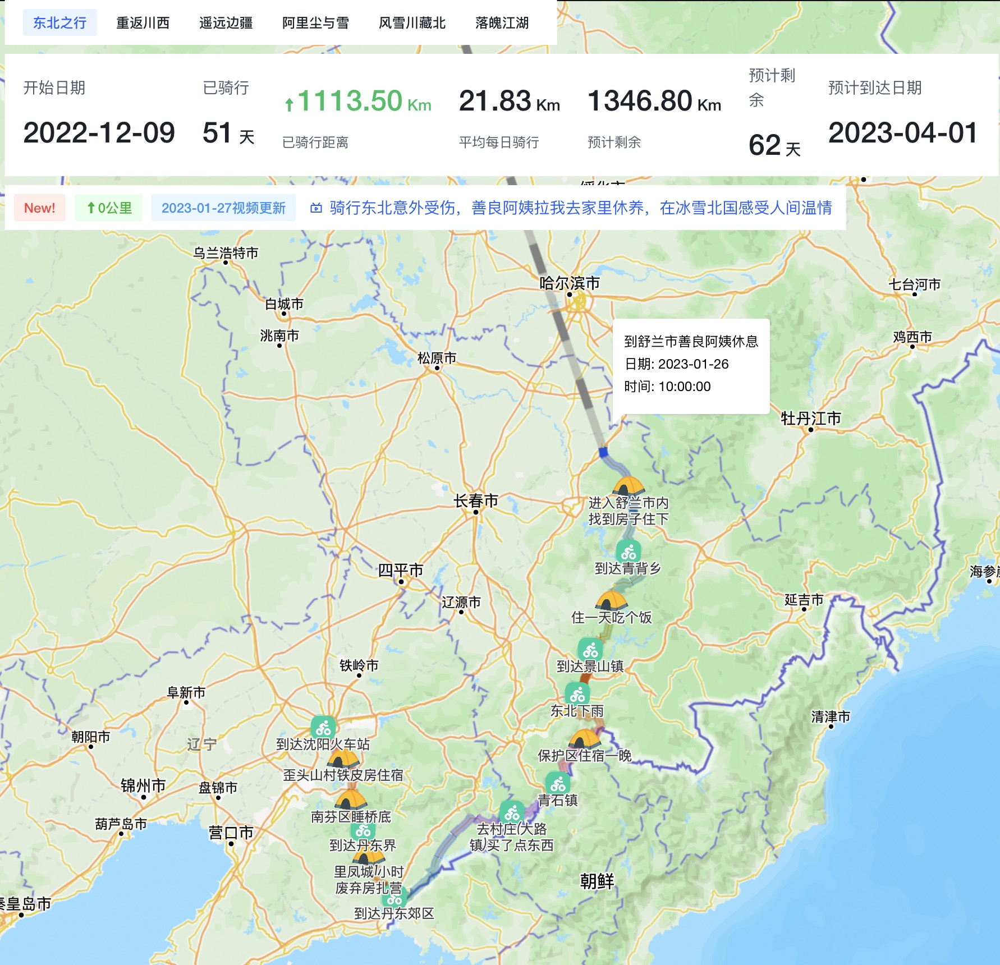

# 徐云流浪中国地图

Web App for <a href='https://github.com/lanseria/xuyun-map-data'>徐云流浪中国地图开源数据</a>

## 功能

- ⚡️查看徐云当前位置（信息延迟）

- 🗂 查看徐云当前行走路线

- 📦 查看徐云每个视频行走轨迹与路程

- 🎨 预计算出到达漠河日期与剩余天数/剩余里程

- 😃 数据包含每个切片地点与视频点

- 🔥 数据开源，凡是有兴趣的都可以贡献或纠错位置点与视频点

- ✅ 数据埋点统计
